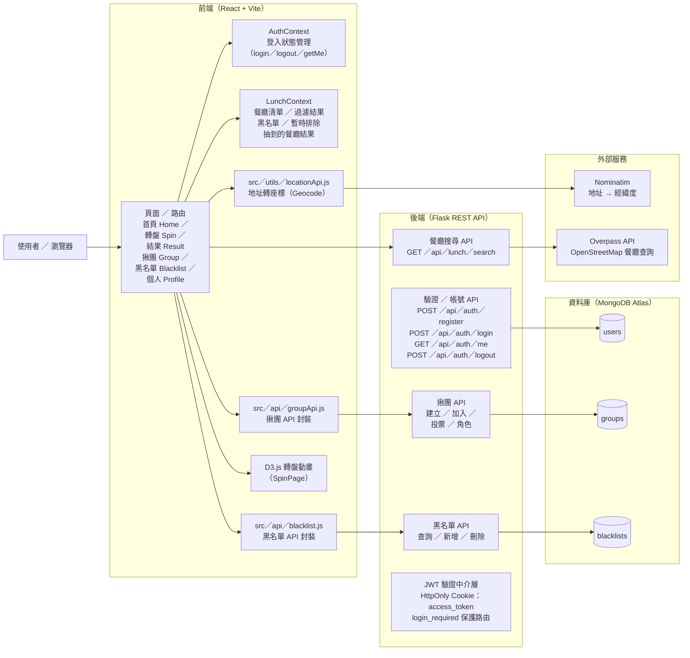
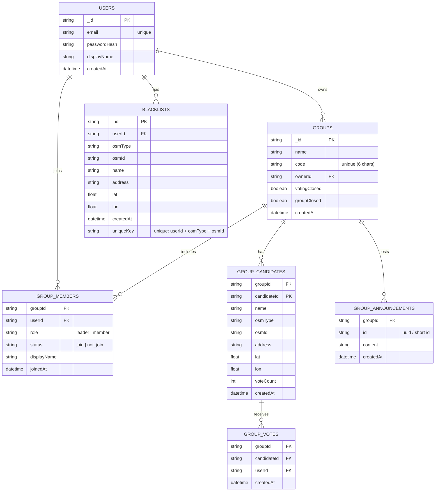

# Lunchpicker
## 系統架構圖


## ERD


## | How to run 
### First-time installation（只有第一次需要安裝）
```
npm install
npm install bootstrap
```
### Run（之後每次啟動只要輸入這個即可）
#### Frontend :
```
cd lunchpicker
npm run dev
```
#### Backend :
```
cd backend
.\venv\Scripts\activate
pip install -r requirements.txt
py app.py
```

## | How to clone/pull/push
### 1. Clone repo.
```
git clone https://github.com/PhoebeLu1011/Lunchpicker.git
cd Lunchpicker
```
### 2. 轉移至&同步main
```
git switch main
git pull origin main
```
### 3. 創建&切換至自己所建立的分支
```
# ex: git checkout -b feature/draw_lots
git checkout -b <新分支名字>
```
### 完成開發後push
```
git add .
git commit -m "填寫自己完成的事項(ex.抽籤功能完成)"
```
```
# ex: git push -u origin feature/draw_lots
git push -u origin <分支名字>
```
push完應該會有pull request merge前記得在群組講一聲

## | File Structure
```
LUNCHPICKER/
│
├── backend/
│   ├── .venv/
│   ├── .env
│   ├── .gitignore
│   ├── app.py
│   └── requirements.txt
│
├── lunchpicker/
│   ├── node_modules/
│   ├── public/
│   │   └── ... (靜態資源)
│   │
│   └── src/
│       ├── api/
│       │   ├── groupApi.js
│       │   └── locationApi.js
│       │
│       ├── assets/
│       │   └── react.svg
│       │
│       ├── components/
│       │   ├── LunchRunner.css
│       │   ├── LunchRunner.jsx
│       │   └── TopBar.jsx
│       │
│       ├── modules/
│       │   ├── ModuleGroup.jsx
│       │   ├── ModuleLunchMain.jsx
│       │   ├── ModuleProfile.jsx
│       │   └── ModuleSimple.jsx
│       │
│       ├── modules/group/
│       │   ├── GroupCandidates.jsx
│       │   ├── GroupCreateForm.jsx
│       │   ├── GroupCreateSuccess.jsx
│       │   ├── GroupDetail.jsx
│       │   ├── GroupJoin.jsx
│       │   └── GroupOverview.jsx
│       │
│       ├── pages/
│       │   ├── AuthPage.css
│       │   ├── AuthPage.jsx
│       │   └── HomePage.jsx
│       │
│       ├── styles/
│       │   ├── Group.css
│       │   ├── App.jsx
│       │   ├── authClient.js
│       │   ├── index.css
│       │   ├── LunchPicker.jsx
│       │   └── main.jsx
│       │
│       ├── .gitignore
│       ├── eslint.config.js
│       ├── index.html
│       ├── package-lock.json
│       └── package.json
│
├── README.md
└── vite.config.js
```
